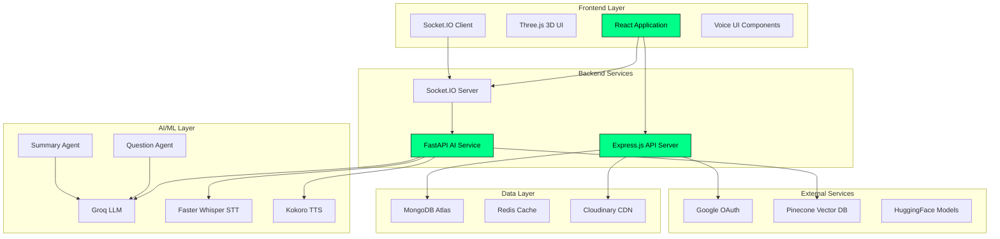
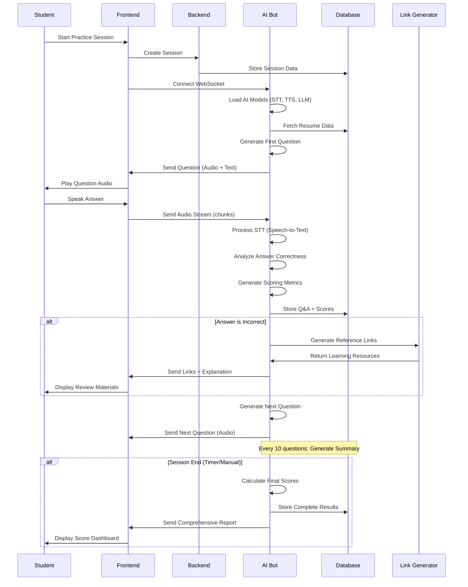

# 🎯 AUXMET - AI-Powered Interview Platform

<div align="center">


[](https://nodejs.org/)
[](https://reactjs.org/)
[](https://python.org/)
[](https://fastapi.tiangolo.com/)
[](https://mongodb.com/)
[](https://socket.io/)

**A cutting-edge AI interview platform that revolutionizes technical recruitment through real-time voice interactions, intelligent questioning, and comprehensive performance analytics.**

[🚀 Live Demo](https://auxmet.com) • [📖 Documentation](#documentation) • [🛠️ Installation](#installation) • [🏗️ Architecture](#architecture)

</div>

---

## 📋 Table of Contents

- [🌟 Overview](#overview)
- [✨ Key Features](#key-features)
- [🏗️ System Architecture](#system-architecture)
- [🛠️ Technology Stack](#technology-stack)
- [📁 Project Structure](#project-structure)
- [🚀 Installation & Setup](#installation--setup)
- [🔧 Configuration](#configuration)
- [📊 API Documentation](#api-documentation)
- [🎯 Usage Guide](#usage-guide)
- [🔄 Data Flow](#data-flow)
- [🧪 Testing](#testing)
- [🚀 Deployment](#deployment)
- [🤝 Contributing](#contributing)
- [📄 License](#license)

---

## 🌟 Overview

AUXMET is an enterprise-grade AI interview platform that transforms traditional recruitment processes through advanced artificial intelligence. The platform conducts real-time voice-based technical interviews, analyzes candidate responses, and provides comprehensive performance insights to recruiters.

### 🎯 Problem Statement

Students and job seekers face significant challenges when preparing for technical interviews:
- **Lack of Practice Opportunities** - Limited access to realistic interview simulations
- **No Immediate Feedback** - Unable to identify weaknesses and improvement areas
- **Interview Anxiety** - Nervousness due to unfamiliarity with interview processes
- **Inconsistent Preparation** - No standardized way to practice across different domains
- **Time Constraints** - Difficulty finding mentors or peers for mock interviews

### 💡 Solution

AUXMET addresses these challenges by providing students with:
- **Unlimited Practice Sessions** - Practice interviews anytime, anywhere without scheduling constraints
- **Instant Performance Analysis** - Real-time feedback on technical skills, communication, and problem-solving
- **Confidence Building** - Familiarize with interview formats to reduce anxiety
- **Personalized Learning** - AI-driven questions based on resume and skill level
- **Comprehensive Preparation** - Cover multiple domains and difficulty levels before real interviews

---

## ✨ Key Features

### 🎤 **Real-time Voice Interaction**
- Advanced Speech-to-Text (STT) using Faster Whisper
- Natural Text-to-Speech (TTS) with Kokoro TTS
- Voice Activity Detection (VAD) for seamless conversation flow
- WebSocket-based real-time audio streaming

### 🧠 **Intelligent Question Generation**
- AI-powered question generation using Groq LLM (Llama models)
- Resume-based personalized questioning
- Adaptive difficulty based on candidate responses
- Domain-specific technical assessments

### 📊 **Comprehensive Analytics & Scoring**
- **Multi-dimensional Scoring System** - Technical skills, communication, problem-solving, and depth of knowledge
- **Domain-specific Evaluation** - Separate scores for different technical domains (Web Dev, ML, etc.)
- **Real-time Performance Tracking** - Live scoring during interview sessions
- **Detailed Performance Reports** - Comprehensive analysis with improvement suggestions
- **Session Summary Generation** - AI-powered summary after every 10 questions for progress tracking

### 📚 **Intelligent Feedback & Learning Resources**
- **Instant Answer Analysis** - Real-time evaluation of responses with correctness indicators
- **Reference Link Generation** - Automatic generation of learning resources for incorrect answers
- **Personalized Study Materials** - Curated learning paths based on performance gaps
- **Question-specific Explanations** - Detailed explanations for complex technical concepts
- **Improvement Recommendations** - AI-driven suggestions for skill enhancement

### 🎨 **Modern User Experience**
- Responsive React frontend with Three.js 3D animations
- Green/Black futuristic theme design
- Real-time interview session management
- Interactive dashboard with performance metrics

### 🔐 **Enterprise Security**
- JWT-based authentication system
- Google OAuth integration
- Secure session management
- Data encryption and privacy protection

---

## 🏗️ System Architecture



### 🔄 **Microservices Architecture**

The platform follows a microservices architecture with three main components:

1. **Frontend Service** (`auxmet-frontend`) - React-based user interface
2. **Backend Service** (`auxmet-backend`) - Express.js API server
3. **AI Bot Service** (`auxmet-bot`) - FastAPI-based AI processing engine

---

## 🛠️ Technology Stack

### **Frontend Technologies**
| Technology | Version | Purpose |
|------------|---------|---------|
| **React** | 18.3.1 | Core UI framework |
| **Three.js** | 0.159.0 | 3D graphics and animations |
| **Framer Motion** | 10.18.0 | Advanced animations |
| **Socket.IO Client** | 4.8.1 | Real-time communication |
| **Tailwind CSS** | 3.4.17 | Utility-first styling |
| **Vite** | 5.4.19 | Build tool and dev server |
| **Lucide React** | 0.294.0 | Modern icon library |

### **Backend Technologies**
| Technology | Version | Purpose |
|------------|---------|---------|
| **Node.js** | 18.x | Runtime environment |
| **Express.js** | 5.1.0 | Web application framework |
| **MongoDB** | 8.13.2 | Primary database |
| **Mongoose** | 8.13.2 | MongoDB object modeling |
| **JWT** | 9.0.2 | Authentication tokens |
| **Passport.js** | 0.7.0 | Authentication middleware |
| **Cloudinary** | 2.6.1 | Media management |
| **bcrypt** | 6.0.0 | Password hashing |

### **AI/ML Technologies**
| Technology | Version | Purpose |
|------------|---------|---------|
| **Python** | 3.11+ | AI service runtime |
| **FastAPI** | 0.116.1 | High-performance API framework |
| **LangChain** | 0.3.26 | LLM application framework |
| **Groq** | 0.30.0 | High-speed LLM inference |
| **Faster Whisper** | 1.2.0 | Speech-to-text processing |
| **Kokoro TTS** | 0.9.4 | Text-to-speech synthesis |
| **Pinecone** | 7.3.0 | Vector database for embeddings |
| **HuggingFace** | 0.3.0 | Transformer models |
| **Socket.IO** | 5.13.0 | Real-time communication |

---

## 📁 Project Structure

```
AUXMET/
├── 📁 auxmet-frontend/          # React Frontend Application
│   ├── 📁 src/
│   │   ├── 📁 components/       # Reusable UI components
│   │   │   ├── Header.jsx
│   │   │   ├── HeroSection.jsx
│   │   │   ├── ThreeBackground.jsx
│   │   │   └── NewVoiceUI.jsx
│   │   ├── 📁 pages/           # Application pages
│   │   │   ├── PreLoginPage.jsx
│   │   │   ├── LoginPage.jsx
│   │   │   ├── InterviewSessionPage.jsx
│   │   │   └── ResultDashboard.jsx
│   │   ├── 📁 store/           # State management
│   │   └── App.jsx
│   ├── package.json
│   └── vite.config.js
│
├── 📁 auxmet-backend/           # Express.js API Server
│   ├── 📁 src/
│   │   ├── 📁 controllers/     # Request handlers
│   │   │   ├── user.controller.js
│   │   │   └── interview.controller.js
│   │   ├── 📁 models/          # Database schemas
│   │   │   ├── users.model.js
│   │   │   ├── interview_session.model.js
│   │   │   ├── results.model.js
│   │   │   └── resume.model.js
│   │   ├── 📁 routes/          # API routes
│   │   ├── 📁 middlewares/     # Custom middleware
│   │   ├── 📁 utils/           # Utility functions
│   │   ├── app.js              # Express app configuration
│   │   └── index.js            # Server entry point
│   └── package.json
│
└── 📁 auxmet-bot/              # FastAPI AI Service
    ├── 📁 src/
    │   ├── 📁 models/          # AI model implementations
    │   │   ├── question_agent.py
    │   │   ├── summary_agent.py
    │   │   ├── audioText.py    # STT implementation
    │   │   └── textSpeech.py   # TTS implementation
    │   ├── 📁 controllers/     # Business logic
    │   │   └── chat_controller.py
    │   ├── 📁 router/          # API routes
    │   │   ├── interview_router.py
    │   │   └── conversation_socket.py
    │   ├── 📁 db/              # Database connections
    │   ├── 📁 prompts/         # LLM prompts
    │   ├── 📁 utils/           # Utility functions
    │   ├── app.py              # FastAPI app
    │   └── main.py             # Service entry point
    ├── requirements.txt
    └── pyproject.toml
```

---

## 🚀 Installation & Setup

### **Prerequisites**
- **Node.js** 18.x or higher
- **Python** 3.11 or higher
- **MongoDB** Atlas account or local installation
- **Redis** server (optional, for caching)

### **1. Clone the Repository**
```bash
git clone https://github.com/yourusername/auxmet.git
cd auxmet
```

### **2. Frontend Setup**
```bash
cd auxmet-frontend
npm install
```

Create `.env` file:
```env
VITE_BACKEND_URL=http://localhost:7575
VITE_BOTBACKENDURL=http://localhost:7576
```

### **3. Backend Setup**
```bash
cd auxmet-backend
npm install
```

Create `.env` file:
```env
PORT=7575
MONGODB_URI=your_mongodb_connection_string
ACCESS_TOKEN_SECRET=your_jwt_secret
REFRESH_TOKEN_SECRET=your_refresh_secret
CLOUDINARY_CLOUD_NAME=your_cloudinary_name
CLOUDINARY_API_KEY=your_cloudinary_key
CLOUDINARY_API_SECRET=your_cloudinary_secret
GOOGLE_CLIENT_ID=your_google_client_id
GOOGLE_CLIENT_SECRET=your_google_client_secret
```

### **4. AI Bot Setup**
```bash
cd auxmet-bot
pip install -r requirements.txt
```

Create `.env` file:
```env
GROQ_API=your_groq_api_key
HUGGINGFACE_API=your_huggingface_token
LLM_MODEL=llama-3.1-70b-versatile
MONGODB_URI=your_mongodb_connection_string
PINECONE_API_KEY=your_pinecone_key
PINECONE_ENVIRONMENT=your_pinecone_env
SESSION_TOKEN=your_session_secret
ALGORITHMS=HS256
BOTAPP_ORIGINS=http://localhost:3000,https://auxmet.com
```

### **5. Start Services**

**Terminal 1 - Frontend:**
```bash
cd auxmet-frontend
npm run dev
```

**Terminal 2 - Backend:**
```bash
cd auxmet-backend
npm run dev
```

**Terminal 3 - AI Bot:**
```bash
cd auxmet-bot
python src/main.py
```

---

## 🔧 Configuration

### **Environment Variables**

#### Frontend Configuration
- `VITE_BACKEND_URL` - Backend API endpoint
- `VITE_BOTBACKENDURL` - AI bot service endpoint

#### Backend Configuration
- `MONGODB_URI` - MongoDB connection string
- `ACCESS_TOKEN_SECRET` - JWT access token secret
- `REFRESH_TOKEN_SECRET` - JWT refresh token secret
- `CLOUDINARY_*` - Cloudinary configuration for file uploads
- `GOOGLE_CLIENT_*` - Google OAuth credentials

#### AI Bot Configuration
- `GROQ_API` - Groq API key for LLM access
- `HUGGINGFACE_API` - HuggingFace token for model access
- `PINECONE_API_KEY` - Pinecone vector database key
- `LLM_MODEL` - Groq model identifier

---

## 📊 API Documentation

### **Authentication Endpoints**
```http
POST /api/v1/user/register
POST /api/v1/user/login
POST /api/v1/user/logout
GET  /api/v1/user/refresh-token
```

### **Interview Endpoints**
```http
POST /api/v1/interview/create-session
GET  /api/v1/interview/sessions
GET  /api/v1/interview/session/:id
DELETE /api/v1/interview/session/:id
```

### **WebSocket Events**
```javascript
// Client to Server
socket.emit('input_audio', {
  audio_buffer: Float32Array,
  isFinal: boolean
});

// Server to Client
socket.on('output_audio', {
  sr: number,
  audio_array: ArrayBuffer,
  text: string,
  length: number
});
```

---

## 🎯 Usage Guide

### **For Students & Job Seekers**
1. **Registration** - Create account or login with Google
2. **Profile Setup** - Upload resume and complete profile
3. **Start Practice Session** - Begin AI-powered interview simulation
4. **Voice Interaction** - Engage in real-time conversation with AI interviewer
5. **Real-time Feedback** - Receive instant analysis and correctness indicators
6. **Session Completion** - Get comprehensive scoring across multiple dimensions:
   - **Technical Skills Score** (0-10 scale)
   - **Communication Skills Score** (0-10 scale) 
   - **Problem Solving Score** (0-10 scale)
   - **Depth of Knowledge Score** (0-10 scale)
   - **Domain-specific Scores** (per technical area)
7. **Review Materials** - Access generated reference links for incorrect answers
8. **Performance Analysis** - Study detailed reports with improvement suggestions
9. **Progress Tracking** - Monitor improvement over multiple practice sessions

---

## 🔄 Data Flow



---

## 🧪 Testing

### **Frontend Testing**
```bash
cd auxmet-frontend
npm test
```

### **Backend Testing**
```bash
cd auxmet-backend
npm test
```

### **AI Bot Testing**
```bash
cd auxmet-bot
python -m pytest tests/
```

---

## 🚀 Deployment

### **Production Deployment**

#### **Frontend (Netlify/Vercel)**
```bash
npm run build
# Deploy dist/ folder
```

#### **Backend (Railway/Heroku)**
```bash
# Configure environment variables
# Deploy with Docker or direct deployment
```

#### **AI Bot (Railway/AWS)**
```bash
# Configure Python environment
# Deploy with Docker container
```

### **Docker Deployment**
```bash
# Build and run with Docker Compose
docker-compose up -d
```

---

## 🤝 Contributing

We welcome contributions! Please see our [Contributing Guidelines](CONTRIBUTING.md) for details.

### **Development Workflow**
1. Fork the repository
2. Create feature branch (`git checkout -b feature/amazing-feature`)
3. Commit changes (`git commit -m 'Add amazing feature'`)
4. Push to branch (`git push origin feature/amazing-feature`)
5. Open Pull Request

---

## 📄 License

This project is licensed under the MIT License - see the [LICENSE](LICENSE) file for details.

---

## 👥 Team

**Aditya More** - *Lead Developer & Architect*
- 📧 Email: [adityamore49891@gmail.com](mailto:adityamore49891@gmail.com)
- 💼 LinkedIn: [Aditya More](https://www.linkedin.com/in/aditya-akm/)
- 🐙 GitHub: [@AKM-2004](https://github.com/AKM-2004)

---

## 🙏 Acknowledgments

- **Groq** for high-speed LLM inference
- **HuggingFace** for transformer models
- **OpenAI** for inspiration and AI research
- **React Three Fiber** community for 3D web development
- **FastAPI** team for the excellent framework

---

<div align="center">

**⭐ Star this repository if you find it helpful!**

[](https://github.com/yourusername/auxmet/stargazers)
[](https://github.com/yourusername/auxmet/network)

**Made with ❤️ and ☕ by the AUXMET Team**

</div>
